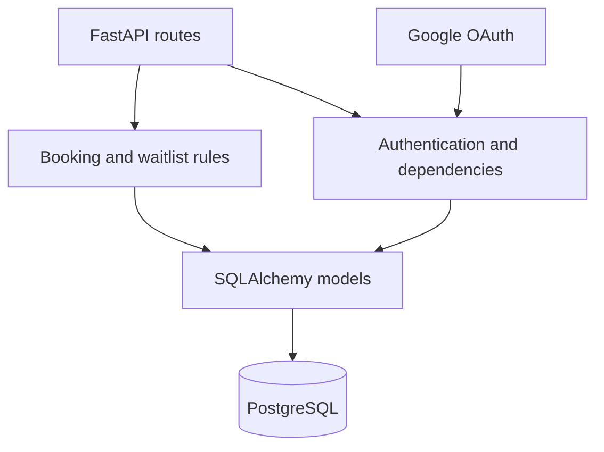

# Taiwan HSR Booking System — Backend

[](https://final-project-frontend-bu6q.vercel.app)
[](https://github.com/rickLHY/final-project-frontend)
[](https://fastapi.tiangolo.com/)

高鐵訂票完整案例的 API、資料模型與核心營運規則。後端使用 FastAPI + PostgreSQL，負責驗證、班次查詢、區間座位分配、票價、訂單、退票與候補。

> 本 repo 是後端；使用者介面與完整案例說明請見 [final-project-frontend](https://github.com/rickLHY/final-project-frontend)。

## 解決的核心問題

一般庫存只需判斷「有或沒有」，車票座位則必須判斷乘車區間是否重疊。例如同一座位可先售出「台北 → 台中」，再售出「台中 → 左營」，但不能同時售出「板橋 → 嘉義」。本系統以停靠站順序完成區間衝突判斷，並讓訂票、退票與候補共用同一套資料規則。

## 功能

- JWT 身分驗證、Email 註冊登入與 Google OAuth 驗證
- 車站、車次、停靠時間、座位與票價資料模型
- 依日期、起訖站查詢班次與區間可用座位
- 票種、早鳥池與自由座車廂規則
- 訂單建立、付款、取消、單張退票與訂位代號查詢
- 候補登記；退票後依班次、區間與座位偏好自動媒合
- 自由座剩餘量與疏運期銷售統計

## 技術棧

FastAPI · PostgreSQL · SQLAlchemy 2 · Pydantic Settings · JWT · Google Auth · Uvicorn

## 架構



## 代表性 API

| Method | Endpoint | Purpose |
| --- | --- | --- |
| `POST` | `/auth/register`, `/auth/login` | 建立帳號與取得 JWT |
| `GET` | `/schedules/` | 依日期與起訖站查詢班次 |
| `GET` | `/schedules/{id}/available-seats` | 查詢指定區間可用座位 |
| `POST` | `/orders/` | 建立 1–6 張票的訂單 |
| `PUT` | `/orders/{id}/pay` | 模擬付款 |
| `PUT` | `/orders/{id}/tickets/{ticket_id}/refund` | 單張退票 |
| `POST` | `/waitlists/` | 登記候補 |
| `GET` | `/schedules/peak-sales` | 查詢銷售率與剩餘座位 |

啟動服務後，可在 `/docs` 查看完整 OpenAPI 文件。

## 本地啟動

```bash
python -m venv .venv
source .venv/bin/activate
pip install -r requirements.txt
cp .env.example .env
python -m scripts.seed_data
uvicorn app.main:app --reload
```

本機 API：`http://localhost:8000`；互動文件：`http://localhost:8000/docs`。

## 測試帳號

種子資料包含本地展示用帳號，詳情請見 `scripts/seed_data.py`。公開部署時請改用安全密碼與獨立 `SECRET_KEY`，不要沿用展示資料。

## 文件

- [Database schema](database-schema.md)
- [DBMS project notes](DBMS_description.md)
- [Frontend application](https://github.com/rickLHY/final-project-frontend)
